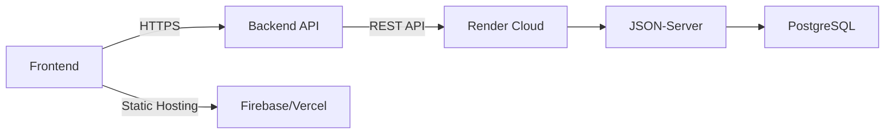

# Smart Goal Planner

[]() 
[]() 
[]() 
[](https://opensource.org/licenses/MIT)

A  savings goal manager featuring:

- **CRUD** Goals (Create, Read, Update, Delete)  
- **Optimistic** Deposits (+ server‑patch to persist)  
- **Visualizations**: Donut, Bar, HeatMap, Health Table  
- **CSV Export** of transactions  
- **Neumorphism & Glassmorphism** UI  
- **Unit & Integration Tests** (≥ 80 % coverage)  
- **Linting & CI**: ESLint, Prettier, Husky, GitHub Actions  

##  Live Deployment

| Environment  | URL                                 |
|--------------|-------------------------------------|
| **Frontend** | [Firebase Hosting](https://smart-goals-4moghe.web.app/) |
|              | [Vercel Deployment](https://smart-goal-theta.vercel.app/) |
| **Backend**  | [Render API](https://smart-backend-vvbe.onrender.com/) |

##  Tech Stack

- **Framework:** React 18 + Vite + React Router v6  
- **Styling:** Tailwind CSS + DaisyUI, custom gradients & shadows  
- **Charts:** Recharts + react-calendar-heatmap + react-confetti  
- **State:** React Context + useReducer (with undo/redo)  
- **Mock API:** json‑server (`db.json`)  
- **Testing:** Vitest, React Testing Library  
- **CI/CD:** GitHub Actions  
- **Hosting:** Firebase, Vercel (Frontend), Render (Backend)  

## Folder Structure

```bash
src/
├── api/api.js             # HTTP helpers for json-server
├── assets/react.svg       # sample asset
├── components/
│   ├── AddEditGoalModal.jsx
│   ├── BarChart.jsx
│   ├── DepositDrawer.jsx
│   ├── DonutChart.jsx
│   ├── GoalCard.jsx
│   ├── GoalHealthTable.jsx
│   ├── HeatMap.jsx
│   ├── LeftNav.jsx
│   └── TopBar.jsx
├── contexts/GoalContext.jsx
├── index.css               # global + utility styles
├── main.jsx                # app entry point
├── pages/
│   ├── Deposits.jsx
│   ├── Goals.jsx
│   ├── Overview.jsx
│   └── Settings.jsx
└── __tests__/              # unit & integration tests
```

##  Prerequisites

- [Node.js](https://nodejs.org/) v18+  
- PNPM package manager  
- VS Code or any modern code editor  

##  Installation

Follow these steps to set up the Smart Goal Planner locally:

1. Clone the repository:
   ```bash
   git clone https://github.com/Rubil-Mogere-94/smart-goal.git
   cd smart-goal-planner
   ```

2. Install dependencies:
   ```bash
   pnpm i
   ```

3. Start development server:
   ```bash
   pnpm run dev
   ```

4. Access the application:
   ```
   http://localhost:5173
   ```

##  Deployment Architecture



##  Author

**Mogere Rubil**
